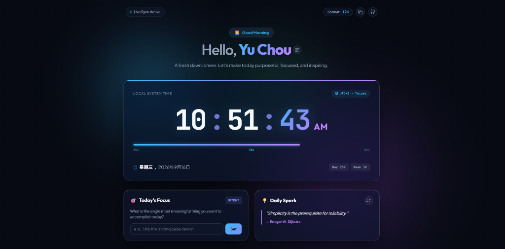

# Personal Hub • Chou Yu

A personal portfolio dashboard and live real-time clock built with a **Deep Aurora Glassmorphism** aesthetic.

🔗 **Live Demo**: [https://taemiyu.github.io/AIOT-DIC-0916/](https://taemiyu.github.io/AIOT-DIC-0916/)



## 👤 Profile & About Me

- **姓名 (Name)**: Chou Yu
- **個人 Avatar**: Custom styled vector developer avatar with chill/sleepy theme
- **科系 (Major)**: 資訊工程研究所 碩一 (Department of Computer Science & Information Engineering, M.S. 1st Year)
- **簡短自我介紹 (Bio)**: 大家好 我喜歡睡覺 😴💤

## 🛠 Skills

1. **Python**: Data science, PyTorch, AI pipelines, model prototyping, and scripting
2. **Java**: Object-oriented architecture, backend development, systems, and data structures
3. **Machine Learning**: Deep learning, neural network training, computer vision, and model optimization

## ⏰ Features

- **Live Dynamic Clock**: Tabular numbers with real-time second progression, seconds progress track, date context, and timezone.
- **Clock Controls**: 12h / 24h format switcher with persistent local storage and one-click timestamp copy button.
- **Today's Focus**: Interactive daily intent tracker with completion state persistence.
- **Daily Spark**: Curated inspiration quotes with shuffle animation.
- **Responsive & Lightweight**: Vanilla HTML5, CSS3, and JavaScript with zero external dependencies.

## Getting Started

Simply open `index.html` in any modern web browser, or serve locally:

```bash
python -m http.server 5173
```

Then visit `http://localhost:5173/`.
